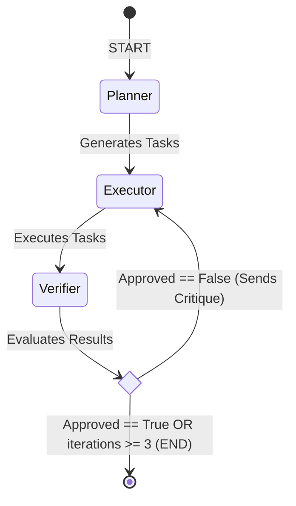

# High-Level Design (HLD): Agentaflow

## 1. Overview
Agentaflow is an autonomous, self-correcting agentic workflow built on top of **LangGraph**. The system leverages **Llama-3.1-8b** (via Groq) to break down complex user goals into sub-tasks, execute them using external web search capabilities, and verify the quality of the execution. It incorporates a cyclical feedback loop to self-improve if the generated output does not meet strict quality thresholds.

## 2. Architecture & Components

### 2.1 State Management (Shared Memory)
The entire workflow relies on a shared state (`AgentState`) passed between nodes. The state schema holds the context for the current run:
- `goal` (String): The original user prompt/objective.
- `tasks` (List of Strings): Sub-tasks generated by the Planner.
- `results` (List of Strings): The execution output for each task.
- `critique` (String): Feedback provided by the Verifier if the result is rejected.
- `approved` (Boolean): A flag denoting whether the Verifier accepted the results.
- `iterations` (Integer): Counter to prevent infinite loops (capped at 3).

### 2.2 Core Agents (Nodes)

#### A. Planner Agent
- **Responsibility:** Ingests the `goal` and breaks it down into a maximum of 5 concrete, actionable steps.
- **Input:** User Goal
- **Output:** Updates the `tasks` array in the state.
- **Mechanism:** Instructed via prompt engineering to return ONLY a valid JSON array of strings to ensure deterministic parsing.

#### B. Executor Agent
- **Responsibility:** Takes the generated `tasks` and sequentially executes them. 
- **Tooling:** Integrated with **DuckDuckGoSearchRun**. Before querying the LLM to complete a task, it performs a search to inject real-time context into the LLM prompt.
- **Self-Correction:** If a previous run was rejected, it ingests the `critique` from the state to adjust its strategy.
- **Output:** Updates the `results` array in the state.

#### C. Verifier Agent
- **Responsibility:** Acts as the quality gatekeeper. It evaluates the combined `results` against the original `goal`.
- **Scoring Rubric:**
  - Completeness (0.0 - 0.4)
  - Accuracy (0.0 - 0.3)
  - Clarity (0.0 - 0.3)
- **Output:** Returns a JSON object containing a total score out of 1.0, an `approved` boolean, and a `critique` string if rejected.

## 3. Workflow Diagram (State Transitions)

The LangGraph architecture defines strict edges and conditional routing to control the flow.

## 4. Key Design Decisions

1. **Deterministic Structured Outputs:** 
   The Planner and Verifier both heavily rely on JSON-enforced outputs to ensure the pipeline doesn't break due to LLM text-generation variability.
2. **Infinite Loop Prevention:**
   The `Verifier` node includes a hardcoded safety net: `if state["iterations"] >= 3`. This guarantees that compute resources (and API tokens) are not exhausted if the LLM gets stuck in a failure state.
3. **Speed over Local Compute:**
   By utilizing Groq's LPU architecture with `llama-3.1-8b-instant`, the latency of traversing the graph multiple times (planning, execution with RAG/Search, and verification) is minimized, creating a responsive agentic system.

## 5. Potential Future Enhancements
- **Parallel Task Execution:** Currently, the Executor loops through tasks sequentially. This could be mapped to execute concurrently using LangGraph's Send API.
- **Dynamic Tool Calling:** Allowing the Executor to dynamically decide which tools to use (e.g., File Reader, Calculator) rather than hardcoding DuckDuckGo for all steps.
- **Human-in-the-Loop (HITL):** Introduce an interrupt before finalizing the Plan or before the END state to allow manual override.
