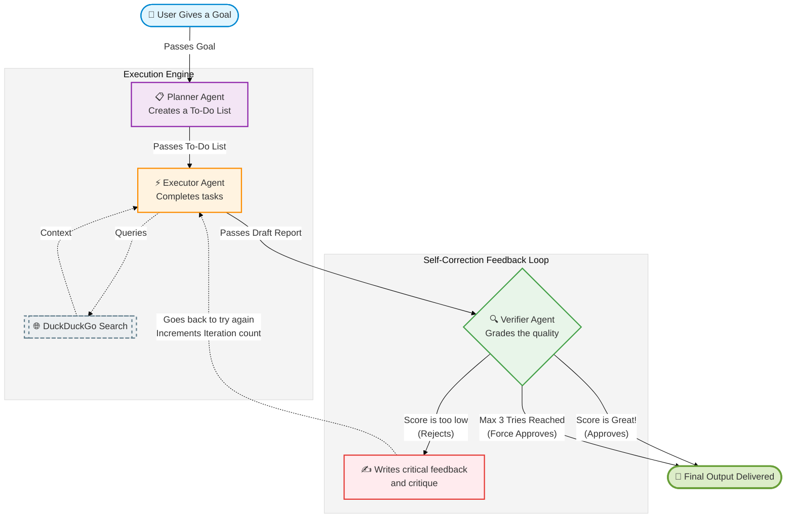

# 🧠 High-Level Design: Agentaflow

Agentaflow is a smart, automated assistant that breaks down a big problem into smaller steps, solves them by searching the web, and double-checks its own work before presenting the final result to you. 

Think of it like a small virtual team with three specialized roles:
1. **The Manager** (Planner)
2. **The Researcher** (Executor)
3. **The Quality Inspector** (Verifier)

---

## 👥 Meet the Team (The Agents)

### 1. 📋 The Planner Agent (The Manager)
- **What it does:** When you give Agentaflow a big goal (like *"Research top 3 AI trends"*), the Planner takes it and creates a simple to-do list.
- **The Rule:** It breaks the main goal down into a maximum of 5 easy-to-manage, actionable tasks so the system doesn't get overwhelmed.

### 2. ⚡ The Executor Agent (The Researcher)
- **What it does:** This agent takes the to-do list from the Planner and starts working on the tasks one by one.
- **Superpower:** It has access to the internet! Before it writes an answer, it uses **DuckDuckGo** to search the web for the most up-to-date and accurate information.
- **Adaptability:** If the Quality Inspector (Verifier) rejects its previous work, the Executor will read the critical feedback and try again, improving its answer.

### 3. 🔍 The Verifier Agent (The Quality Inspector)
- **What it does:** Once the Executor finishes all the tasks, the Verifier reads the final report and grades it based on three strict criteria:
  - **Completeness:** Did it answer the whole question?
  - **Accuracy:** Is the information correct and relevant?
  - **Clarity:** Is it easy to read and well-structured?
- **The Decision:** 
  - If the score is good enough, it **Approves** the work, and the process finishes.
  - If the score is too low, it **Rejects** the work, writes a critique explaining what went wrong, and sends it *back* to the Executor to fix it.

---

## 🔄 How They Work Together (The Workflow)

Agentaflow uses a "feedback loop." It won't stop until the answer is good, but it has a built-in safety switch so it doesn't get stuck in an endless loop forever.

---

## 🧠 The "Brain" (Shared Memory)
As these agents pass the work back and forth, they use a shared memory block (called State) so they don't forget what they are doing. This memory holds:
- The original **Goal** the user asked for.
- The **To-Do List** (Tasks) created by the Planner.
- The **Draft Results** found so far by the Executor.
- The **Critique** (if they made a mistake on the last try).
- How many **Tries** (Iterations) they've done.

## 🚀 Why is it built this way?
1. **Self-Correcting:** By having a Verifier double-check the work, the AI catches its own mistakes and hallucinations instead of passing them directly to you.
2. **Super Fast:** It uses the `Llama 3.1` AI model powered by **Groq**. Groq uses specialized hardware that makes the AI think and type incredibly fast, meaning these feedback loops happen in seconds rather than minutes.
3. **No Endless Loops:** If the system is struggling and the Verifier rejects the work 3 times in a row, the system forces an approval so you still get the best possible attempt without waiting forever.
