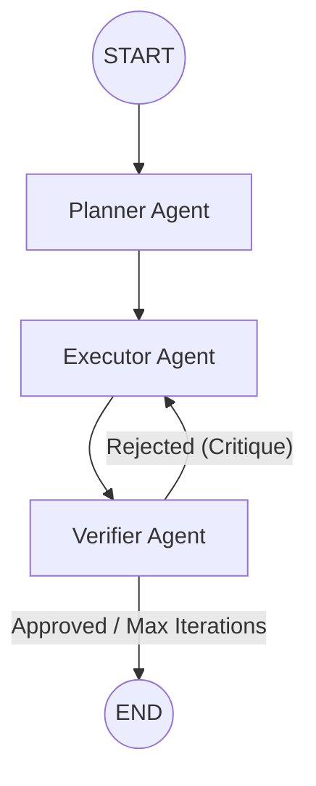

# Agentaflow 🚀

[](https://python.langchain.com/docs/langgraph)
[](https://groq.com)
[](https://ai.meta.com/blog/meta-llama-3-1/)

Agentaflow is an intelligent, self-correcting multi-agent workflow built using **LangGraph** and powered by **Groq**'s ultra-fast inference with the Llama 3.1 model.

It takes a complex goal, breaks it down into actionable tasks, executes them (with real-time web search capabilities), and rigorously verifies the output against a quality rubric. If the output isn't up to par, the agents automatically critique and improve it in a feedback loop!

## ✨ Features

- **🧠 Planner Agent:** Deconstructs complex user goals into a manageable JSON array of concrete tasks.
- **⚡ Executor Agent:** Processes each task individually. It has access to the **DuckDuckGo Search Tool** to pull in real-time context from the web.
- **🔍 Verifier Agent:** Acts as a quality control gate. It evaluates the execution based on *Completeness*, *Accuracy*, and *Clarity* (scoring 0.0 to 1.0).
- **🔄 Self-Correction Loop:** If the Verifier rejects the output, it provides a critique and sends the task back to the Executor for refinement (safeguarded by a max 3-iteration limit).
- **💨 Blazing Fast:** Leverages `llama-3.1-8b-instant` via Groq for near-instantaneous reasoning.

## 🛠️ Architecture

Agentaflow uses a state graph defined with `langgraph`.



## 🚀 Getting Started

### Prerequisites

- Python 3.9+
- A [Groq API Key](https://console.groq.com/keys)

### Installation

1. **Clone the repository:**
   ```bash
   git clone https://github.com/ayush300302/Agentaflow.git
   cd Agentaflow
   ```

2. **Install dependencies:**
   ```bash
   pip install -r requirements.txt
   ```

3. **Environment Setup:**
   Create a `.env` file in the root directory and add your Groq API key:
   ```env
   GROQ_API_KEY=your_groq_api_key_here
   ```

### Usage

Run the main script:

```bash
python 01.py
```

By default, the script will execute the following goal:
> *"Research and summarise the top 3 trends in generative AI for 2025"*

To change the goal, simply edit the `initial_state` dictionary at the bottom of `01.py`:

```python
initial_state = {
    "goal":  "Your custom goal here...",
    "tasks" : [],
    "results": [],
    "critique" : "",
    "approved" : False,
    "iterations" : 0
}
```

## 📦 Dependencies

- `langgraph` - Orchestration of the agentic state machine
- `langchain-groq` - LangChain integration for Groq
- `langchain-community` - Provides the DuckDuckGo search tool
- `python-dotenv` - For managing environment variables
